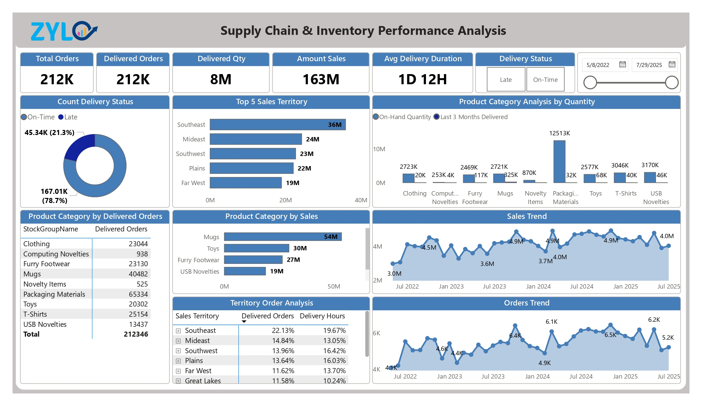

# 📦 Supply Chain & Inventory Performance Dashboard (Power BI)

This repository contains a comprehensive Power BI project that delivers actionable insights into **inventory**, **order fulfillment**, and **supplier performance** for a wholesale distribution business (WideWorldImporters). It is designed for real-time visibility and operational efficiency.

🔗 **Live Repo:** [supplychain-inventory-performance-pbi](https://github.com/Juwel2121/supplychain-inventory-performance-pbi/)  
🔗 **Live Report:** [supplychain-inventory-performance-pbi-report](https://app.fabric.microsoft.com/view?r=eyJrIjoiYTg1ZGQ0MmItMGE5Mi00NWZiLWFmMjktM2YxYTY2MmRhMTgwIiwidCI6IjhkMWJmZjgzLTI0NDEtNGNmYS05NTc3LTE5MzAwMTk5ZGY3OCIsImMiOjN9)

---

## 📊 Report Overview

### 1️⃣ Inventory Overview
- Track stock status, quantity on hand, and inventory value by category
- Highlight low-stock and overstocked items
- KPI cards for key inventory metrics

---

### 2️⃣ Order Fulfillment & Delivery
- Monitor order delays, expected vs. actual delivery performance
- On-time delivery rates with territory and method breakdowns
- Insight into late delivery patterns

---

### 3️⃣ Supplier Performance
- Supplier fulfillment rate and total purchases
- Payment and invoice insights
- KPIs for order reliability and purchase trends

---

## 🧱 Architecture

This project is built using **Microsoft Fabric** and **Power BI**, following the **Medallion Architecture**:
- **Bronze Layer:** Raw source data
- **Silver Layer:** Cleaned and transformed data
- **Gold Layer:** Domain-specific aggregated data used in Power BI

**Key Tools:**
- Lakehouse
- Notebooks
- Dataflows Gen2
- Pipelines (orchestration)
- Power BI Desktop for report authoring

---

